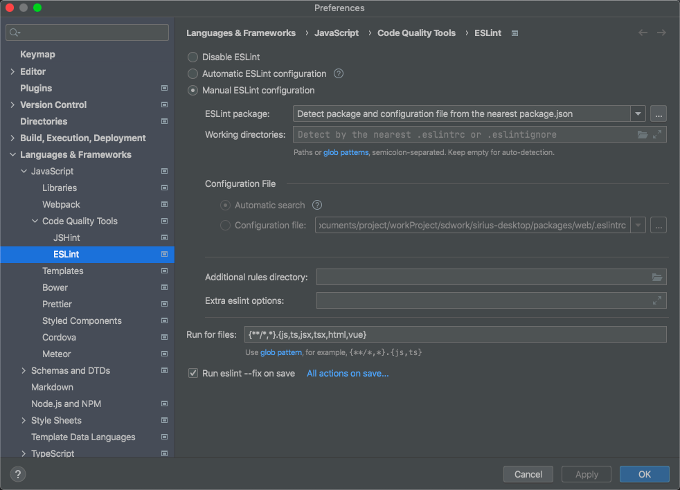

# 通用 UI 组件

一些通用的 UI 组件，这些组件是和 UI 的同学一起共建的一套标准的 UI 库。UI 稿也会使用这些组件来进行设计，所以大家尽量使用这些组件来进行开发，如果组件使用中有任何问题，请联系lujiajian@office.163.com。（更详细的介绍待补充）

1. [组件化](https://lingxi.office.163.com/doc/#id=19000005867912&from=PERSONAL&parentResourceId=19000004498486&spaceId=504939058&ref=518256141&type=doc)
2. 组件文档：https://sirius-desktop-web-pre.lx.netease.com/compDoc/doc/
   

# 项目目录结构

1. modified_third_party :<br>
   更改后三方库存放地点，项目中所用的编辑器 tinymce 和 metion 在此处维护
2. nginx-conf ：<br>
   线上部署时使用的 nginx 配置文件
3. nginx_dev_conf：<br>
   本地开发部署环境使用的 nginx 配置文件, 辅助测试 build 后的打包文件
4. packages/api :<br>
   接口定义及数据处理逻辑，封装后端调用及数据库，缓存等处理逻辑，为 UI 层提供平整的业务逻辑接口支持
5. packages/api/src 代码文件 （内部结构待补充）
6. packages/api/test 测试文件
7. packages/api/package.json 项目定义
8. packages/electron:<br>
   electron 工程，当前版本无大量的特性化开发，主要使用 web 端能力支撑业务， 支持将 web 端 build 完成的工件发布成 window 和 mac 上可运行的文件
9. packages/electron/src 代码文件 （内部分为两部分）<br>
   packages/electron/src/lib 运行在浏览器 render 进程中的 lib 代码，编译后生成 packages/electron/dist/electron/lib/index.js ，由 preload.js 加载后运行于浏览器，注册为全局变量 electronLib <br>
   packages/electron/src/main electron 主程序代码，运行于 electron 主程序中，<br >
   由于 web 中调试工具不可见，可通过 packages/electron/src/main/fsManage.ts 中的 log 方法将 log 写入文件进行调试
10. packages/electron/package.json 项目定义
11. packages/web ：<br>
    UI 模块，负责用户交互及界面渲染，依赖 api 层实现具体业务逻辑
12. packages/web/src 代码文件 （内部结构待补充）
13. packages/web/package.json 项目定义

14. .gitlab-ci.yml：<br>
    ci 流程定义文件，提交 master / dev 分支时会触发 ci 构建流程，构建的产物可以用户服务器发布， <br>
    构建脚本将自动按照分支不同构建不同发布版本，
15. package.json <br>
    项目整体定义文件

# 项目构建

1. 项目开发 IDE 推荐使用 vsCode 或 webStorm, <br/>
   1. webStorm 需配置 Preferences | Language & Frameworks | JavaScript | Code Quality Tools | ESLint 中 enable ESLint ,推荐在 save 时自动执行 ESLint 修复<br />
      见下图： 
   2. vsCode 也推荐使用同样配置
2. 项目使用 yarn 进行 build install 等操作，第一步先安装 yarn <br>
   `npm install --global yarn`
3. 安装项目所用依赖，仅需要在根目录下进行安装即可<br>
   `yarn install` <br>
   第一次运行需全局需安装的工具：<br>

- 查找依赖冲突的工具：<br>
  `yarn global add --dev yarn-deduplicate` <br>
- 调试用 https 环境工具，<br>
  mac 开发环境可执行：<br>
  `brew install nss` <br>
  `brew install libsass` <br>
  windows 开发环境参考：<br>
  https://github.com/davewasmer/devcert#how-it-works <br>
- nodejs 的跨环境脚本执行工具 <br>
  `npm install -g shelljs` <br>
- typescript doc 工具：<br>
  `npm install typedoc --save-dev`

4. 构建或启动项目前，可以执行 `yarn clean` 以便清理缓存和构建必要的脚本
5. 构建 api 项目，可在在根目录下执行 <br>
   `yarn workspace env_def build test mac && yarn workspace api build` ， 脚本先构建了 env 项目，使用了 test 环境，构建适配 mac 的系统 <br/>
   后面一句为使用已经构建好的定义来继续构建 api 层的代码
6. 构建 web 项目，可在 web 项目文件夹内部使用 <br>
   `yarn build:web` 或 `yarn workspace web build` ，注意这种情况可能不会自动构建 api 项目，需要先执行 api 构建 <br />
   也可以根目录使用上述命令，根目录的 build 仅 build web 项目 <br>
   web 项目的输出文件在 packages/web/public
7. 构建 electron 项目 可在 electron 项目内部使用 <br>
   `yarn run build:app` 或 `yarn workspace sirius-desktop build` <br> ， 构建版本由 api 构建时声明的 环境变量 定义 <br />
   会同时生成 mac 和 window 的安装文件,安装文件位于/releases-[test|prod|prev] 文件夹内
8. 可构建版本供四类：<br />
   **local** <br /> 开发版，通常不构建，开发调试时使用此 profile,链接本地的 gastby 调试插件（http-proxy-middleware）， 通过配置 packages/web/gatsby-config.js 转发各类请求进行调试
   ,此版本访问服务 domain: https://su-desktop-web.cowork.netease.com:8000/ <br />
   **test** <br /> 测试版，提测时构建，版本号无意义，通常与将发布的正式版版本号相同 ,安装后打开各个窗口会自动打开调试工具，便于排查错误，此版本访问服务 domain : https://sirius-desktop-web.cowork.netease.com/ <br />
   **test2** <br /> 测试版， 连开发环境，提测时构建，版本号无意义，通常与将发布的正式版版本号相同 ,安装后打开各个窗口会自动打开调试工具，便于排查错误，此版本访问服务 domain : https://sirius-desktop-web2.cowork.netease.com/ <br />
   **prev** <br /> 预览版，内部试用版，安装后可与正式版共存，版本号命名类似：0.13.7 其中 13 标识线上当前版本为 1.3.x，7 标识在正式版 1.3.x 发布正式版后的第七个预览版 ，
   预览版基本与正式版无区别，mac 版本无签名，此版本访问服务 domain: https://lingxi.office.163.com/ <br />
   **prod** <br /> 正式版, 发布到线上供用户下载使用的版本 ，此版本访问服务 domain:https://lingxi.office.163.com/ <br />

# 项目开发

## 关于代码运行和调试

1. 安装好各类依赖后，执行 `yarn clean` 来清理并初始化环境
2. 启动 web 环境进行调试可执行:
``` javascript
   第一步：构建需要启动的环境
   灵犀：`yarn workspace web build:lx_env`
   外贸：`yarn workspace web build:edm_env`
   外贸部分模块：`yarn workspace web build:edm_fast_env`
   web-entry-wm: `yarn workspace web-entry-wm build:edm_env`
   web-entry-ff: `yarn workspace web-entry-ff build:edm_env`

   第二步：开发调试命令
   灵犀/外贸： `yarn workspace web dev`
   外贸部分模块：`yarn workspace web dev:edm_fast`
   web-entry-wm: `yarn workspace web-entry-wm dev`
   web-entry-ff: `yarn workspace web-entry-ff dev`

   ** 注意
   1.第一次构建完环境后，以后的启动就只需要执行第二步，否则构建速度会慢。
   2.切换环境前需要`yarn clean`然后重新走第一步和第二步。
   3.提供的构建的环境只适用于开发环境，需要启动prev,prod 请自行去到web下的package.json修改命令中的提供的参数
```

3. 启动 electron 环境进行调试可执行：<br />
 ```javascript
   灵犀：`yarn test:test1`
   外贸：`yarn test:edm:test`
 ```
   待命令执行成功后，
   即可看到 electron 的调试工程，<br/><br/>
   **[以下说明已过期，不符合事实]**
4. 如需要使用`file://`协议调试 electron 工程，可执行：<br />
   `yarn workspace sirius-desktop build:test:mac` <br />
   待命令执行成功后，再执行 <br />
   `yarn workspace sirius-desktop prod` <br />
   即可调试项目 <br>
   **[以上说明已过期，不符合事实]**
   <br/><br/>
5. electron 的数据目录记录在全局变量`electronLib.env.userDataPath`中，通常为/Users/【用户名】/Library/Application Support/sirius-desktop ， 此目录中 logs 下，有系统的运行日志
6. 使用`commond+shift+option+I` 可以打开应用的调试面板，在邮件搜索处，搜索`*#devtools*#`有同样效果
7. 注意 node 和 npm 的版本，推荐使用如下版本的开发工具，否则可能引发未知错误：<br/>

- yarn 1.22.11
- node 14.17.5
- npm 6.14.14

1. win 开发机, 环境配置的一些注意事项

- 设置 npm 运行脚本的环境, script-shell 设置为 bash 环境. 否则一些脚本无法识别
- host 中添加 127.0.0.1 su-desktop-web.cowork.netease.com
- 确保运行 shell 的 terminal 具有管理员权限. 一些脚本运行涉及权限

## gatsby 开发环境证书过期处理
- 第一步：rm -rf ~/Library/Application\ Support/devcert 删除这个文件夹(gatsby 生成)
- 第二步：打开钥匙串，找到devcert颁发的证书删除
- 第三步：重新执行gatsby开发命令


## 关于部署及打包发布

### 诺亚部署

后端支持完备的情况下，部署此应用仅需部署 nginx 服务，nginx 服务提供两项功能：

- web 页面的 host
- electron 桌面端应用的各接口转发
  <br>

#### 部署 nginx 的说明：

1. nginx 部署于[诺亚环境](http://noah.netease.com/#/poseidon/app/appDetail?appName=sirius-desktop-web&productName=%E7%81%B5%E7%8A%80%E9%83%A8%E9%97%A8%E5%85%AC%E5%85%B1%E6%9C%8D%E5%8A%A1) , 诺亚环境目前分四个集群：
   1. 生产环境 cwonline 对应环境变量**prod**, 通常部署 master 分支，属于线上使用，工作时间 8：30-19：30 ，非特殊情况不进行部署，部署后全部灵犀办公用户可见，访问 url : https://lingxi.office.163.com/
   1. 预发环境 cwpre 对应环境变量**prev**,可部署任意分支，网络及各基础设施均属于线上，故可能和某些测试机器网络不互通，用于部署预发布版本做线上回归验证，平时也可以用作测试部署，访问 url ： https://sirius-desktop-web-pre.lx.netease.com/
   1. 测试环境 cwtest 对应环境变量**test**,可部署任意分支，提测用环境，基础设施属于测试环境，访问 url : https://sirius-desktop-web.cowork.netease.com/
   1. 开发环境 cwdev 对应环境变量**dev**,可部署任意分支，提测用环境 2，基础设施属于测试环境，访问 url : https://sirius-desktop-web-dev.cowork.netease.com
      <br/>
      诺亚环境部署需在集群的集群部署面板，先构建要部署分支的镜像，然后点击发布，全部默认配置基本就可以完成部署，如遇到无法部署或部署后访问出错等问题，可以回滚 <br />
1. 构建诺亚环境部署所需镜像的步骤：<br />
   诺亚镜像构建需要上传一个代码包构建的工件（artifact）到[制品平台](https://artifact-admincp.lx.netease.com/#/artifact/artifact) , 本应用制品平台的应用标识：sirius-desktop-web <br />
   构建工件步骤：<br />
   1. 执行项目中脚本 ./script/ssh_pack_machine 登录打包机 ，密码 cowork
   1. 在打包机中 进入/Users/cowork-desktop/Project/sirius-desktop 或 /Users/cowork-desktop/Project/sirius-desktop-v2 目录（ 其他 sirius-desktop-cospread , sirius-desktop-edm 目录分别给文档和外贸邮团队使用）
   1. 目录中执行 脚本 ./build_web_deploy.sh 【环境】 【操作】 【备注】 即可启动构建，脚本会自动完成包括编译，打包，上传等一系列动作；
      - 脚本中【环境】标识打包要部署的诺亚环境，使用上文中的环境变量标识，如不传入则默认使用 test 环境进行构建 -【操作】用于指定要进行的操作，包括 clean， build ， upload 三种，分别标识清理，构建，上传，通过输入第二个参数选择执行其中一个或多个，默认执行构建上传，传入多个参数时，可以用"-"分割，例如： clean-build-upload
      - 【备注】会展示在制品平台，用于区分特定包，无其他实际逻辑意义，由于特定原因，**使用中文可能导致上传失败**
      - 脚本样例 ： ./build_web_deploy.sh test clean-build-upload for-xxxx-test

#### 构建 electron 桌面端

1.  可登录打包机，或在自己的工程目录
1.  执行脚本 ./build_app.sh 【环境】 【系统】 【操作】 【备注】即可启动构建，脚本会自动完成包括编译，打包，上传等一系列动作；
    - 其中 同样参数参考构建工件脚本
    - 【系统】参数可以传入多个系统用于构建 mac ，win, win32 的安装包
    - 脚本样例： ./build_app.sh prev "win mac win32" clean-build-upload test-xxx-function

## 关于分支

1. master 为开发的发布分支，master 分支和线上发布的应用代码保持同步，<br>
   每次线上发布后，会从 master 分支记录一个代码的 tag 版本，tag 版本命名与线上的应用版本同名
1. test 作为中间状态分支，在 master 版本发布后保留和 master 同样的代码，test 分支支持在 master 发布后做 fix 更改，以便于发布修复线上问题的 patch 安装包，<br />
   test 原则上不合并 dev，test 分支上的改动在稳定后会合并到 master 和 dev 上，test 的 merge request 只接受 xxx-fix 命名的更改
1. dev 为开发的主分支，dev 分支不接受未进过调试,或调试不通过的代码，所以提交到 dev 的代码需要保障可编译，可发布测试环境，<br >
   dev 分支有新提交后，会自动触发 ci 构建新的发版代码包，此代码包可发布测试环境, 每个开发均可在 [诺亚平台](http://noah.netease.com/#/poseidon/operate) 上操作发布 <br>
1. dev 分支可以在任何提交 merge-request, 不限于开发周期，dev 如进行了合并，其他开发应该尽可能早的将更改合并进自己分支，避免后续产生更多冲突
1. master 分支不接受除 dev 分支以外的任何分支的 merge request , master 分支仅在上线才进行版本合并和更新

## 代码开发流程

### 分支拉取

1. 所有的功能开发须从 dev 拉取新分支进行开发，拉取新分支名约定为【人员-功能描述-\*-(dev|fix)】，结尾可以使 dev，表示为开发功能的分支， 或者是 fix，表示为修复某些问题的分支，参考 git 命令 <br>
   `git checkout -b [人员]-[功能描述]-[其他任意描述]-dev origin/dev` <br >
   特殊情况下从某开发分支拉取的新开发分支，也应遵守上述约定，
1. 针对同一个开发人员开发多个功能的情况，如功能间无强关联，建议拆分多个分支进行维护，强烈不推荐同一个分支中开发多个功能，会影响后续的代码合并流程
1. 除上述 dev,master 两个分支，其他每个分支需要有唯一的开发维护，此人为此分支的 owner（后续均以 owner 称呼此人），此人也即此分支名称最前方的人员，
1. 分支可以相互 merge 以共用开发中的代码，强烈不建议其他人更改并提交 owner 非自己的分支，分支互相 merge 时建议遵循关于 merge 的说明

### 分支提交

1. 分支提交需额外提供 commit message 信息，需用中/英文明确本次提交的内容，更改目的，更改目的可以是开发某个功能或者修复某个 bug,如修复 bug，建议带上 jira bug 号或链接<br />
   建议本地用 rebase 合并多次提交的提交信息，然后再 push 到远端
1. 分支提交前需额外检查提交文件是否符合代码的硬性规约，建议先进行本地执行`yarn workspace web start`之后再提交

### 分支合并

1. 分支 merge（**包括开发中普通分支相互 merge**）建议提交 gitlab 的 merge-request , 被 merge 的分支的 owner 的使用 gitlab 的功能进行提交内容确认后执行 merge , <br />
   如此操作便于保留 merge 记录，从而更好的维护源码和检查错误
1. 除 master, dev 的分支也可以本地进行 merge 后推送远端，操作参考 git 命令 <br >
   `git fetch && git switch [要合并的分支] && git pull && git switch [自己分支] && git merge [要合并的分支]` ，<br/>
   之后解决完冲突后 commit & push 即可
1. 合并 dev 需要先本地将 dev 分支合并到自己分支，并处理好所有冲突（注意和改动者沟通），提交到自己分支的远端，然后在 gitlab 平台提交 merge 到 dev 分支的 merge-request <br />
   merge request 建议写明本次 merge 的目的，包括并不限于：解决的 bug 的链接，完成的功能的名称，优化的代码模块及说明，然后将**merge request 指派给所更改的[模块的负责人](#merge-charger)**
   ，<br />
   由熟悉各个模块代码的人员辅助进行代码检查，目的是避免引入未知的错误，并通过审核交流，提高团队的代码质量<br />
   未列入模块分工列表的各个小模块（如图片预览模块），可以群里沟通后，指定辅助的检查人员 <br />
   如开发提交的功能，恰好是自己负责的审查的，可以指定给自己，也可以统一指定给石晟
1. 提交 merge request 和并 dev , 建议勾选 【'Delete source branch when merge request is accepted.'合并后删除原分支】 和 【'Squash commits when merge request is accepted.'
   将所有提交合并为一个合并进新分支】两个选项，<br >
   如勾选合并后删除原分支 , 后续的功能修改及维护，可以拉取新分支进行，应该并不比继续在原分支更改更复杂<br />
   （否则肯定是原分支的某些特殊东西没有提交，开发中不推荐此种做法，也不禁止）

### 三方库引入

1. 非必要不引入三方库，
1. 如需引入新的三方库，需评估三方库的质量（通过看 github 上评星，fork 等），以及关注三方库的协议是否允许商用
1. 引入三方库需要确认影响范围，如库的能力偏向域全局性，而非某个特定的局部功能使用，推荐和团队讨论，达成一致后引入。
1. 引入的三方库需要尽可能熟悉，确保可以在必要时维护三方库的代码以保障工程质量

## 编码规范

编码规范目前主要使用 eslint 来保障，具体细节可参考 .editorconfig , 其配置与 eslint 配置基本一致

### 命名

#### 命名法介绍

大驼峰式命名法（Pascal Case）：首字母大写，各单词首字母大写。eg：StudentInfo、UserInfo、ProductInfo <br />
小驼峰式命名法（Camel Case ）：首字母小写，各单词首字符大写。eg：studentInfo、userInfo、productInfo <br />
小写式命名法 ： 全部小写，单词间用下划线分割。eg: student_info、user_info、product_info <br />
大写式命名法 ： 全部大写，单词间用下划线分割。eg: STUDENT_INFO、USER_INFO、PRODUCT_INFO <br />

#### 文件,文件夹命名

文件名不得含有空格 <br />
文件名建议只使用小写字母，不使用大写字母。( 为了醒目，某些说明文件的文件名，可以使用大写字母，比如 README、LICENSE。 ) <br />
文件名采用小写式命名。（部分特殊文件采用大写式命名） <br />
文件夹命名与文件命名规则相同 <br />

#### 变量命名(含 class 内成员变量)命名

命名方式 : 小驼峰方式 ，推荐使用名词，<br />
推荐：<br />`let tableTitle = "LoginTable"` <br />
class 内私有成员变量在此基础上加前置下划线： '\_', eg : <br/>
`readonly _name = 'name'; // 私有成员`

#### 函数(含 class 内成员函数)命名

命名方式 : 小驼峰方式 ，推荐使用动词，<br />
可以使用特定前缀表达函数的意义：

<table>
<thead>
<tr>
<th>动词</th>
<th>含义</th>
<th>返回值</th>
</tr>
</thead>
<tbody>
<tr>
<td>can</td>
<td>判断是否可执行某个动作 ( 权限 )</td>
<td>函数返回一个布尔值。true：可执行；false：不可执行</td>
</tr>
<tr>
<td>has</td>
<td>判断是否含有某个值</td>
<td>函数返回一个布尔值。true：含有此值；false：不含有此值</td>
</tr>
<tr>
<td>is</td>
<td>判断是否为某个值</td>
<td>函数返回一个布尔值。true：为某个值；false：不为某个值</td>
</tr>
<tr>
<td>get</td>
<td>获取某个值</td>
<td>函数返回一个非布尔值</td>
</tr>
<tr>
<td>set</td>
<td>设置某个值</td>
<td>无返回值、返回是否设置成功或者返回链式对象</td>
</tr>
</tbody>
</table>
class内私有的函数同样加前置下划线： '_' ,<br />
eg :
<blockquote>
//是否可阅读 <br />
function canRead(){
    return true;
}  
<br />
// 类内函数 <br />
class EventHandler{ <br />
  &nbsp;&nbsp; handleEvent(ev:Event){} <br />
  &nbsp;&nbsp; private _handleEventInternal(ev:Event){} <br />
}
</blockquote>

#### 常量命名

命名方式：大写式命名法 ，推荐名词, eg: <br />
`let MAX_COUNT = 10;`

#### 组件名，类名，接口名，类型名，模块名命名

命名方式： 大驼峰式命名法 ，推荐名词， eg: <br />
`export const EventHandler=new EventHandler();`<br  />
`export type EventType = **** ;`<br  />

#### 其他命名规范

1. 非模块入口，全局入口，禁止使用 index.xxx 的命名方式
1. 重要的全局性 KEY，遵守以下命名方式：

- 全局 Event Name
- 模块内组件间 Redux Key
- 全局定义数据 Map，以*GBMAP*为前缀

### 关于图片

- 图片尽量使用 svg 格式， png 格式的图片推荐导出时使用 2x 或者更高分辨率
- 图片推荐使用 css 作为资源引入，background-image 的属性可以正常支持大部分场景，
- svg 如需要写入 react 组件中，应该修改 svg 的对应属性为 react 的风格，否则会弹出很多错误警告

### 通用代码查找及积累

- packages/api/src/api/util/index.ts ： 通用的字符串，日期处理，数据转换函数，<br>此处函数要求：无状态，基础计算及转换，不引入 UI 层概念，实现较为简单通用
- packages/api/src/api/commonModel.ts: 通用数据结构，<br> 此处函数要求：纯数据结构，无外部三方依赖
- packages/web/src/hooks : 各类 react 相关的调用和通用函数封装 <br> 此处函数要求：不包含界面 UI，主要处理各类 hook，state，effect 相关的通用过程
- packages/web/src/components/UI：各类全局通用 UI 组件，<br> 此处函数要求：主要为界面组件及组件的处理逻辑，css 样式，需要可以再多个模块内复用才维护到此

### 项目通用支持

- EventApi <br>
  自定义事件发送及监听 API，定义位于：packages/api/src/api/data/event.ts，<br>
  提供多窗体间，IFrame 间，Web worker 间，以及同一个 window 内部的个组件间相互通信的手段，<br>
  此外通过配置消息类型的属性，还可以实现消息的持久化，消息的流量控制，消息的生命周期管理等功能，可以极大简化开发
- HttpApi <br>
  网络请求 API，定义位于 packages/api/src/api/data/http.ts，<br>
  提供 http ajax 请求的通用封装，提供的基础能力包括，自动重登陆功能，自动合并重复请求功能，通用错误处理及提示功能，自动非标返回处理等
- DbApiV2 <br>
  数据库操作 API，定义位于 packages/api/src/api/data/new_db.ts <br>
  提供 indexedDb 的操作能力，提供按登陆用户自动链接对应数据库的能力，提供数据库基础的增删改功能（支持批量处理），提供按主键查询，按索引查询以及高级查询等查询功能
- SystemApi <br>
  系统相关的各类 API，定义位于 packages/api/src/api/system/system.ts <br>
  提供包括当前登陆用户查询，当前登陆节点查询，创建新窗口，查询当前窗口信息，设置全局定时事件，判断运行环境等能力，此 API 主要包含系统相关的各类支持，具体参考 api 定义
- 其余相关支持可参考<br/>
  [办公项目文档](https://lingxi.office.163.com/doc/#id=19000000557540&from=QIYE&parentResourceId=19000000697029&spaceId=3993514&ref=503636239&activedSheetIndex=0) :<br>
  https://lingxi.office.163.com/doc/#id=19000000557540&from=QIYE&parentResourceId=19000000697029&spaceId=3993514&ref=503636239&activedSheetIndex=0

## 开发人员及分工

模块 merge reviewer 暂定如下：<br />

<table id="merge-charger">
<thead>
<tr><th>模块</th><th>人员</th></tr>
</thead>
<tbody>
<tr><td>邮件读信内容展示部分 </td><td> 张培源、周昊、卢家坚               </td></tr>
<tr><td>邮件文件夹及列表部分 </td><td> 张培源、周昊、卢家坚              </td></tr>
<tr><td>邮件写信部分 </td><td> 王立军，胡凡                           </td></tr>
<tr><td>IM部分 </td><td> 郭超，张青松                              </td></tr>
<tr><td>日历部分 </td><td> 周宗仁，贾俊伟                             </td></tr>
<tr><td>云文档部分 </td><td> 陈绪发，郭同禹                           </td></tr>
<tr><td>云文档文档展示页面 </td><td> 陈潜，郭同禹                           </td></tr>
<tr><td>通讯录部分 </td><td> 邹明亮、周宗仁                            </td></tr>
<tr><td>账户设置部分 </td><td> 邹明亮，石晟                            </td></tr>
<tr><td>邮件设置部分 </td><td> 卢家坚，胡凡                          </td></tr>
<tr><td>Electron相关 </td><td> 邹明亮、石晟                       </td></tr>
<tr><td>推送部分</td><td> 郭超，石晟                       </td></tr>
<tr><td>UI、React基础组件</td><td> 周宗仁、胡凡、邹明亮                     </td></tr>
<tr><td>登录/网络请求/db/localstorage等基础组件 </td><td> 石晟      </td></tr>
</tbody>
</table>

### 灵犀迭代开发建议

- 代码mr采用多人review制度，需要讲解修改背景及范围。 提交MR需要再 灵犀开发小队中发布信息，同步 测试 和其他开发。*测试/封包/小版本阶段 不接受私底下提交代码，自己合mr。<br>
- 开发周 遇到线上反馈问题，评估优先级，修改成本高可把修复时间列入排期当中。迭代周期可接受预留1/4开发时间buffer来修复线上问题。<br>
- 对制品进行完整性校验，目前代码报错仍可以打包成功，但会导致数据后台启动不了，影响很多业务功能。提交代码前需执行构建检查（例yarn workspace env_def build test1 web && yarn workspace api build && yarn workspace api build:bk_init )<br>

**参考本地文件 readme.md,欢迎更改内容，提交新的规范和说明**
